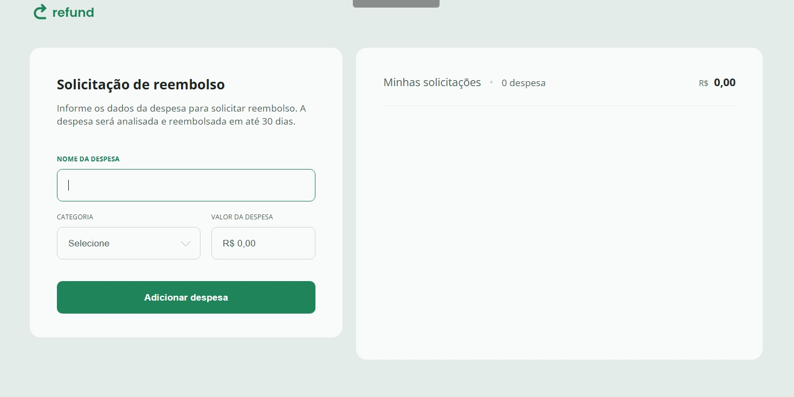

## 💸 Expense Control — Controle de Despesas



Projeto desenvolvido durante o curso da **Rocketseat**, com o objetivo de **praticar JavaScript**, entender a **manipulação do DOM** e reforçar conceitos fundamentais de programação web.

---

### 🧩 Tecnologias utilizadas

- **HTML5**
- **CSS3**
- **JavaScript (ES6+)**

---

### ✨ Funcionalidades

- Adicionar despesas com descrição, categoria e valor 💰  
- Atualização automática do total de despesas 🔄  
- Validação de entrada para evitar erros ⚠️  
- Remoção individual de despesas 🗑️  
- Interface responsiva e agradável 📱  

---

### 🧠 Conceitos praticados

- Manipulação do **DOM**
- **Eventos** (`onSubmit`, `onClick`, `onInput`)
- Conversão e formatação de valores (`parseFloat`, `toLocaleString`)
- Criação e remoção dinâmica de elementos HTML
- Organização de código e uso de **funções** com **parâmetros**

---

### 🚀 Como rodar o projeto

1. **Clone este repositório:**
   ```bash
   git clone https://github.com/Andersondev123/expense-control.git

2. Acesse a pasta do projeto:

cd expense-control

3. Abra o arquivo index.html no navegador
ou utilize a extensão Live Server no VSCode.